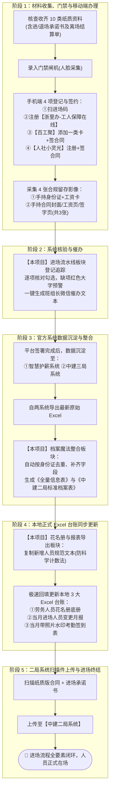
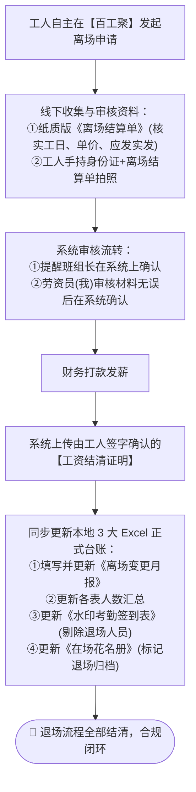

# 📋 个人劳务工作辅助系统 · 业务规约与系统流转全景 (project_content)

> **版本**：v2026.09 · 正式规约  
> **使用对象**：劳资管理人员（本人专用辅助工具）  
> **核心使命**：以业务流程为主线，消除跨平台重复录入，杜绝材料与步骤遗漏，保障合规闭环与零纠纷。

---

## 目录
- [一、项目定位与三层架构体系](#一项目定位与三层架构体系)
- [二、系统矩阵与数据权责边界](#二系统矩阵与数据权责边界)
- [三、进场全生命周期工作流（Onboarding）](#三进场全生命周期工作流onboarding)
- [四、退场全生命周期工作流（Offboarding）](#四退场全生命周期工作流offboarding)
- [五、软件模块与业务动作精确映射表](#五软件模块与业务动作精确映射表)
- [六、系统设计与维护原则（防过度设计规约）](#六系统设计与维护原则防过度设计规约)

---

## 一、项目定位与三层架构体系

本项目本质为**个人工作协调层 / 办公辅助层**，而非官方业务系统的替代品，亦非面向大众的通用 SaaS 软件。

实际劳务管理工作由以下三个紧密咬合的层次组成：

```
┌─────────────────────────────────────────────────────────────┐
│ 1. 官方业务系统（智慧护薪 / 三局系统 / 二局系统 / 百工聚 / 浙里办 / 小灵光）    │
│    👉 权威业务事实：真正业务办理、实名制认证、合同网签、发薪结清备案    │
└──────────────────────────────┬──────────────────────────────┘
                               │ 导出原始数据 / 线上审核流转
                               ▼
┌─────────────────────────────────────────────────────────────┐
│ 2. 本辅助系统（建筑劳务综合管理平台 · 个人协调中枢）          │
│    👉 工作流协调与防漏：追踪谁缺什么材料、一键清洗合并去重、差异比对、智能催办 │
└──────────────────────────────┬──────────────────────────────┘
                               │ 一键复制规范文本 / 极速回填
                               ▼
┌─────────────────────────────────────────────────────────────┐
│ 3. 本地 Excel 台账（总包/公司正式受检资料与底册）            │
│    👉 正式结果载体：在场花名册、进退场变更月报、水印签到表、标准档案表      │
└─────────────────────────────────────────────────────────────┘
```

---

## 二、系统矩阵与数据权责边界

| 系统类别 | 系统名称 | 承担角色与法定功能 | 产生/交互的关键数据 |
|---|---|---|---|
| **政务/官方系统** | **智慧护薪系统** | 浙江省/杭州市建筑工人实名制与工资监管官方平台 | 官方备案花名册、专户发薪记录 |
| **总包/母公司系统** | **中建三局智慧工地** | 总包劳务综合管理平台 | 实名制进场信息、现场劳务档案 |
| **局级管理系统** | **中建二局智慧劳务** | 局级标准劳务管理与档案监管系统 | 纸质合同与进场承诺书扫描件上传、二局标准档案表 |
| **移动端/签约平台** | **百工聚** | 手机端进场加卡、电子合同签署、自主发起离场 | 一类工资卡绑定、电子合同、离场申请 |
| **政务实名小程序** | **浙里办 · 工人保障在线** | 浙江省人社实名制官方备案渠道 | 工人现场扫码进场、实名认证 |
| **电子签约小程序** | **人社小灵光** | 人社官方电子劳动合同签约工具 | 官方电子劳动合同签章确认 |
| **个人协调系统** | **本项目系统** | 汇聚数据、追踪流转、催办预警、整合报表 | 进退场看板、合并主表、催办文案 |
| **正式受检台账** | **本地 Excel** | 公司检查、审计归档要求的正式台账 | 劳务花名册、进出场月报、水印签到表 |

---

## 三、进场全生命周期工作流（Onboarding）

进场是劳务合规风险最高、材料最繁杂的阶段。整个流程分为 5 个连续闭环阶段：



### 1. 进场必须提交与收集的资料清单

#### ① 纸质版材料（共 10 类，进场一次性备齐/预签）
1. **简易劳动合同**（纸质版，双方签字盖章）
2. **体检单**（合格且无禁忌疾病）
3. **三级安全教育培训卡**（班组、项目部、公司三级签字）
4. **承诺书**（遵章守纪承诺）
5. **进场承诺书**（进场须知与安全告知）
6. **岗前培训试题**（考核答卷及评分）
7. **考勤签到表（两张）**（务工人员现场按红手印）
8. **进场花名册**（纸质登记签字）
9. **退场承诺书**（*合规预置：进场时预先签署退场遵纪承诺*）
10. **离场结算单**（*合规预置：进场备齐结算底单，防后续失联扯皮*）

#### ② 门禁系统
- **人脸录入 / 闸机通行权限下发**

#### ③ 移动端与小程序操作（共 4 项）
1. **现场进场码**：现场扫描工地专属实名制进场二维码
2. **浙里办 · 工人保障在线**：注册并完成浙里办实名认证
3. **百工聚平台**：绑定务工人员本人开立的**一类银行卡**（严禁二类卡或非本人卡），并在线签署合同及告知书
4. **人社小灵光**：注册认证，完成人社官方电子劳动合同签约

#### ④ 必须留存的关键影像档案（共 4 张）
1. **手持工资卡合照**：务工人员一手持本人身份证、一手持本人一类工资银行卡正面，头像及卡号文字清晰（证明银行卡为本人开立并用于受薪）。
2. **劳动合同影像套件（3张）**：
   - 工人手持身份证 + 签订完成的《劳动合同》**封面**合影
   - 工人手持身份证 + 明确载明**日工资金额/单价**条款页合影
   - 工人手持身份证 + 工人签名按手印与单位盖章的**签字页**合影

---

## 四、退场全生命周期工作流（Offboarding）

退场是消除劳资纠纷隐患的最关键关口，必须严格按照“工人发起 ➔ 双级确认 ➔ 发放结算 ➔ 结清凭证 ➔ 台账销账”的顺序流转。



### 退场核心核对要点
1. **纸质离场结算单**：必须有工日汇总、单价核算、应发金额、实发金额，并经班组长与工人本人签字按手印。
2. **手持结算单照片**：手持身份证 + 纸质结算单正脸清晰合照，防纠纷法定凭证。
3. **工资结清证明**：银行流水/发薪凭单 + 工人本人签字确认的《劳务人员工资结清承诺书》，并在官方系统上传。
4. **在场人数动态消减**：系统立即扣减在场人数，联动更新报表大屏，本地台账同步销账。

---

## 五、软件模块与业务动作精确映射表

| 业务场景 | 实际工作动作 | 对应的本项目软件模块 | 系统提供的高效支撑能力 |
|---|---|---|---|
| **进场手续** | 检查10类纸质资料、录门禁、4项小程序办理、4张合规照片 | **🚀 进场流水线追踪** (`modules/onboarding_pipeline.py`) | 卡片式分类勾选、缺项大字高亮、进度百分比、一键生成微信催促文案、导出进度表 |
| **数据同步** | 智慧护薪导出名单 + 三局系统导出名单 | **📁 档案魔法整合** (`modules/info_merge.py`) | 跨两系统智能对齐、按身份证去重去乱码、自动导出《全量信息表》与《二局标准档案表》 |
| **台账维护** | 更新花名册、变更月报、水印签到表 | **📑 花名册与报表导出** (`modules/archive_export.py`) | 一键提取新增/离场名单、防科学计数法、纯文本直接粘回本地 Excel |
| **离场清算** | 工人离场审核、收结算单、照片核验、发薪结清上传 | **🛫 离场流水线追踪** (`modules/offboarding_pipeline.py`) | 四步流转闭环、结清证明归档、自动扣减在场人数、一键生成离场台账 |
| **考勤工资** | 分包队伍考勤、总包闸机、项目部考勤核对 | **💰 考勤对账与工资结算** (`modules/attendance_payroll.py`) | 三方工日智能对账、差异标红预警、定稿确认、自动生成工资发放总表 |
| **态势总览** | 检查当前各队在场人数、进出场趋势、合规率 | **📊 人员变更面板** (`modules/personnel_dashboard.py`) | 6大专业图表联动计算，无需重复传表，月度动态深度钻取 |

---

## 六、系统设计与维护原则（防过度设计规约）

1. **唯一最高目标**：一切设计与代码改动均以**“让我本人的工作更快、更准、更少出错”**为 P0 原则。
2. **严禁产品化脑补**：不引入多租户、SaaS 化、组织架构树、通用权限管理、付费订阅等假想功能。
3. **尊重大数据源分工**：
   - 官方系统管业务与法律事实；
   - 本项目管工作协同、追踪防漏与格式整理；
   - Excel 管正式汇报受检台账。
4. **平滑兼容至上**：所有数据字段扩展必须考虑旧版本数据加载安全，不发生闪退或 KeyError。
